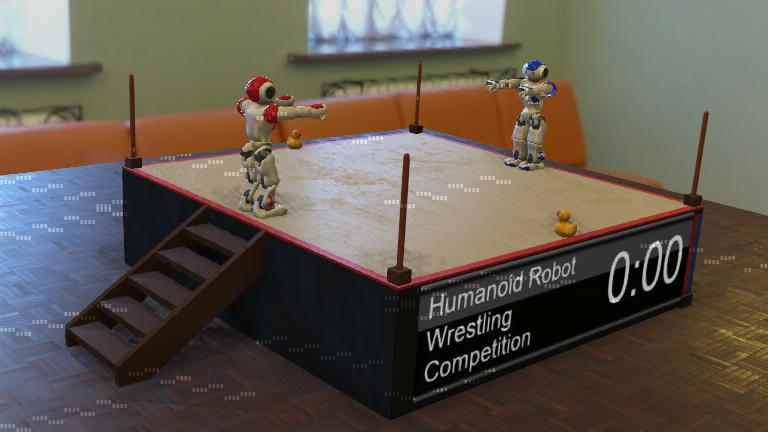

# Humanoid Robot Wrestling Competition

<!-- This is the shield badge where you can replace the webots.cloud link in brackets with your personal webots.cloud page -->

## Description

Two simulated humanoid robots are wrestling against each other.

## Information

- Difficulty: Master
- Robot: NAO
- Language: Python
- Commitment: as much as you want

---

## How to participate

### Summary

- Create your own entry repository from this template.
- If you set your repository as private, add this repository's creator as a collaborator.
- Register your entry by posting an issue on this repository.

### Create your own entry repository from the template

1. [Click here](../../generate) to create your own repository automatically or do it manually by clicking on the green button "Use this template":
   1. Fill the "Repository name" field with a name for your controller.
   1. Choose the visibility of your controller, keep it "Public" if you don't care about people looking at your controller code otherwise set it to "Private".
   1. Finally, click on the green button "Create repository from template".

You should now be on your **own** repository page and not the benchmark creator's repo. **This is important** in order to be able to use the links in the following chapters.

#### If you set your repository as private, add the organizer as collaborator

1. [Click here](../../settings/access) to go to the "Collaborators" setting page
   1. You might need to confirm the access by re-entering your GitHub password.
1. You should see a "Manage access" box where you will see the current collaborators of the repo.
Click on the "Add people" and search for "Jean-Eudes-le-retour". When you found the organizer, add them to the repository.

### Register by posting an issue

1. Go back to the main page of your repository if that is not the case and copy the repository URL from the address bar to your clipboard.
1. [Click here](https://github.com/Jean-Eudes-le-retour/wrestling-benchmark/issues/new?assignees=&labels=registration&template=registration_form.yml&title=Registration+to+benchmark) to go to the organizer repository and start your registration. If it doesn't work, you can do it manually by going to the organizer's repository, then to the "Issues" tab, creating a new issue and choosing "Registration to benchmark".
1. Paste your repository URL in the URL field and click the "Submit new issue" button.

A series of automated actions will take place in a few seconds. If everything went well, you should get a message saying that you are successfully registered to the benchmark. If there was a problem, read the feedback message, fix what is wrong and post a **"retry"** comment on the registration issue to re-run the automated verification.

This issue page is important, as it will allow you to post commands to interact with the evaluation bot, mainly to update your score with a **"run"** command. To save this link somewhere, you can edit this [README file](../../edit/main/README.md) and change the following line with your link:

INSERT YOUR LINK HERE

The available commands are:

- **"run"**: this will execute an automated test of your controller and update the leaderboard with its performance and the animation files.
- **"unregister"**: use this command if you want to unregister your controller from the leaderboard.

### Modify the template controller and/or create your own one

Everything should be good to go, you can modify the main controller files in the controllers folder.

The supervisor controller is the special controller that is used to evaluate your controller's performance. You can look at its source code to understand more in detail how your controller will be evaluated but changing it won't influence your final performance in the leaderboard.

Your controller is evaluated in a [Docker container](https://www.docker.com/resources/what-container/). If your robot controller has dependencies, such as some specific libraries, python modules or a complete ROS framework, be sure to update the [controller_Dockerfile](controller_Dockerfile) to include all these dependencies. The default Webots Docker container includes the tools needed to run and compile simple C, C++ and Python controllers.
